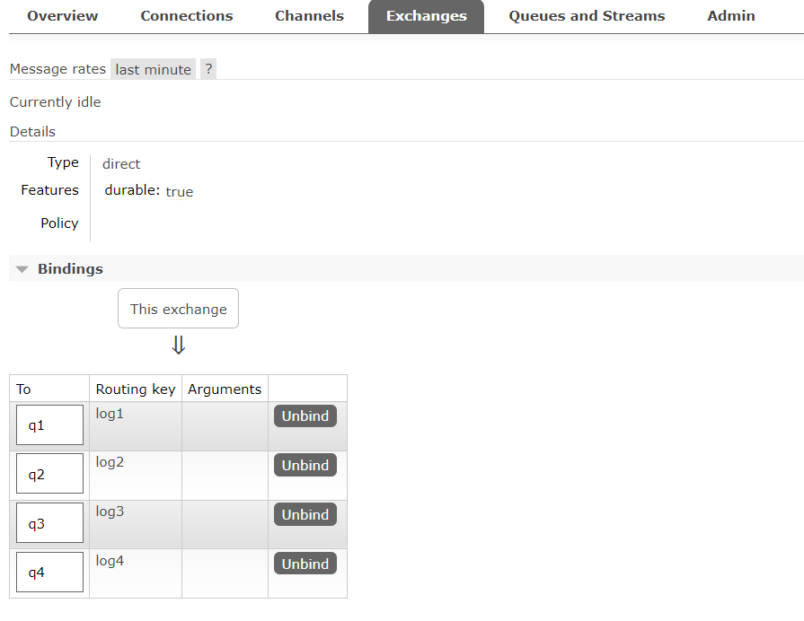
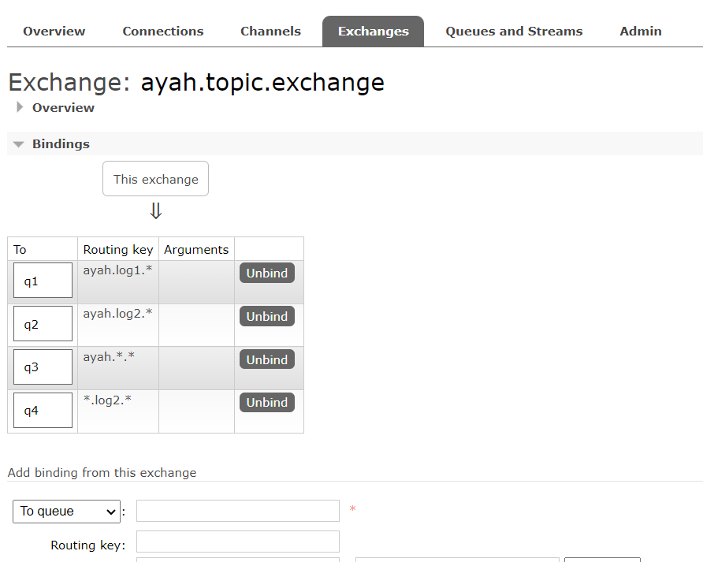
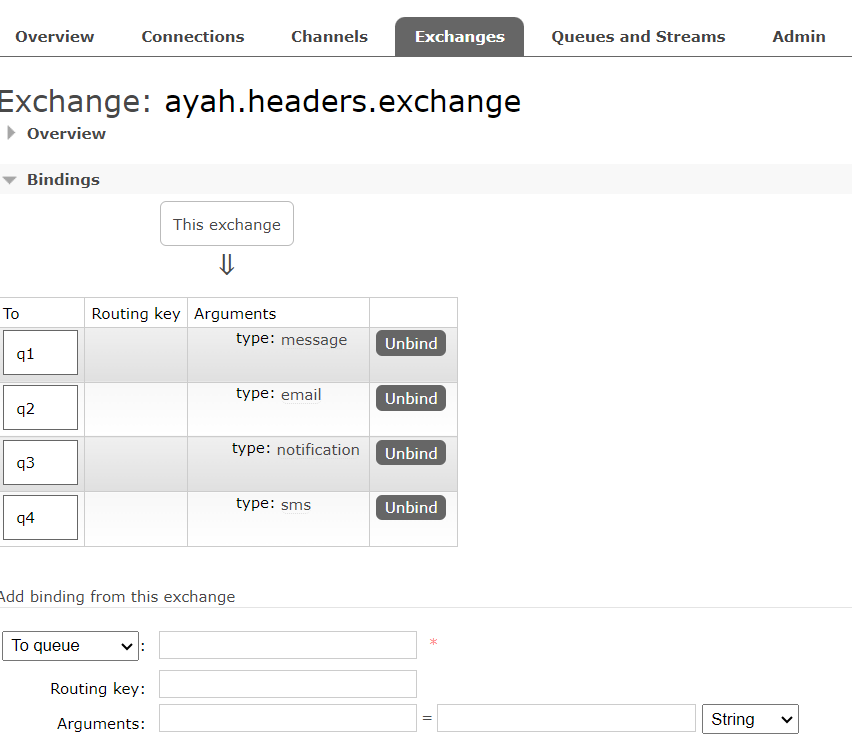
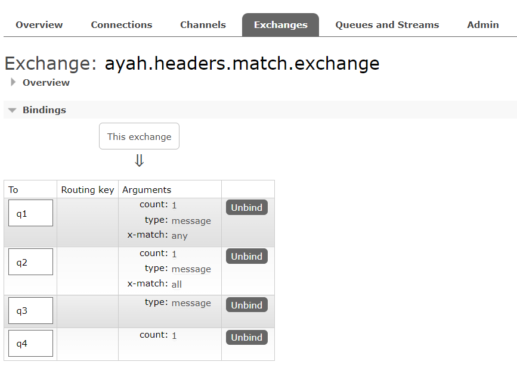
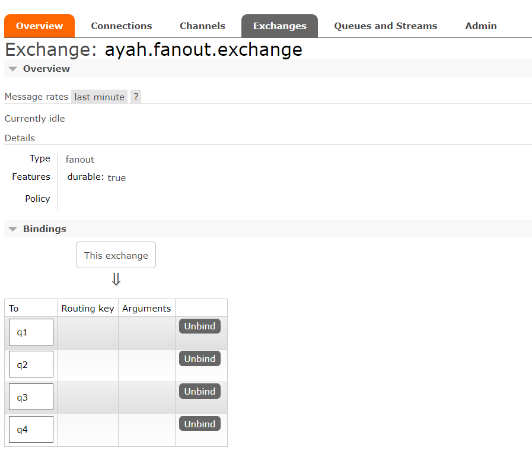

# Getting Started

## RabbitMQ Docker Image

```powershell
docker run -d --name rabbitmq -p 5672:5672 -p 15672:15672 -e RABBITMQ_DEFAULT_USER=userName -e RABBITMQ_DEFAULT_PASS=password rabbitmq:3.12-management
```
then run docker image.

## Download SpringBoot Example

download springboot project from <a href="https://github.com/AyahAlrifai/RabbitMQ/tree/main">here</a>

## Update application.properties File
update the following prop in application.properties, then run the application

```properties
spring.rabbitmq.host=localhost
spring.rabbitmq.port=port
spring.rabbitmq.username=username
spring.rabbitmq.password=password
```

## Swagger URL

After run application you can access swagger documentation from here
[http://localhost:8088/rabbitmq/swagger-ui/index.html#/](http://localhost:8088/rabbitmq/swagger-ui/index.html#/)

## RabbitMq After Run Application



---



---



---



---

