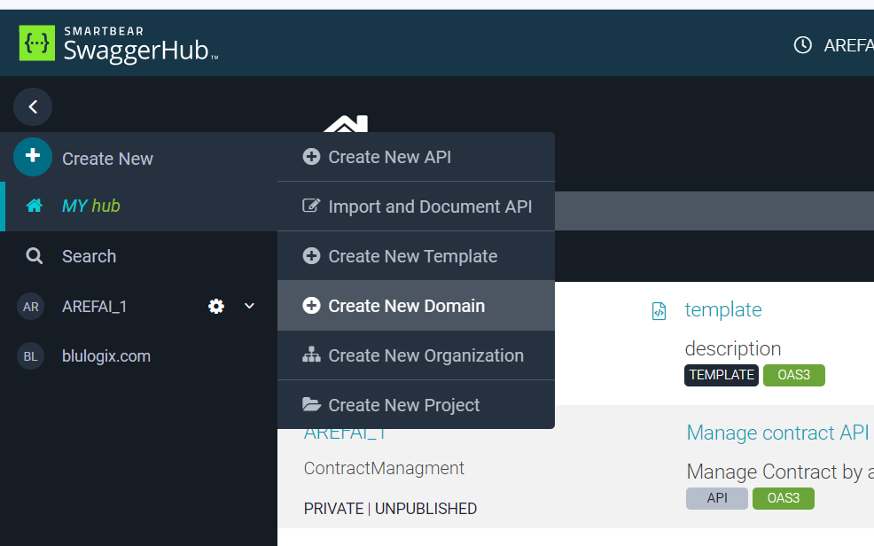
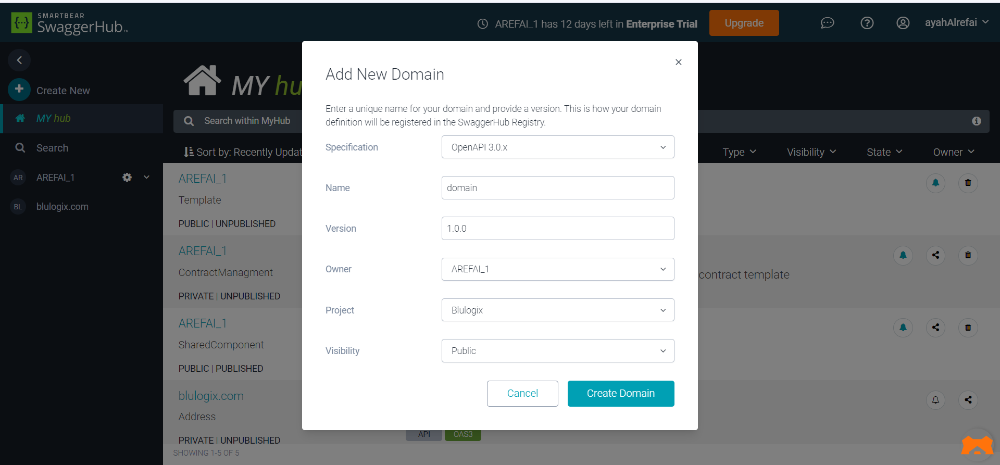
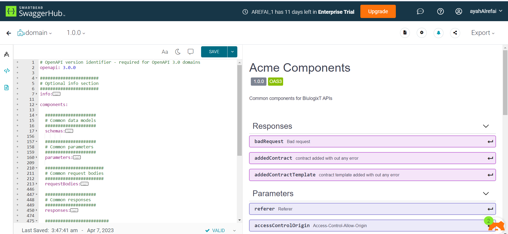

# Create Domain

Domains are a collection of reusable components. The components that can be stored inside a Domain are:

- info: information about domain
- components:
    - schemas
    - parameters
    - requestBodies
    - responses
    - headers
    - examples
    - links
    - callbacks

## Steps

## Domain Example
- [documentation](https://app.swaggerhub.com/domains/AREFAI_1/domain/1.0.0)
- [publish](https://app.swaggerhub.com/domains-docs/AREFAI_1/domain/1.0.0)

:::info

check this link to learn how to use domain components in API [how to use domain](../swaggerCodeSyntax/externallyDefinedComponents/#from-domain)

:::

