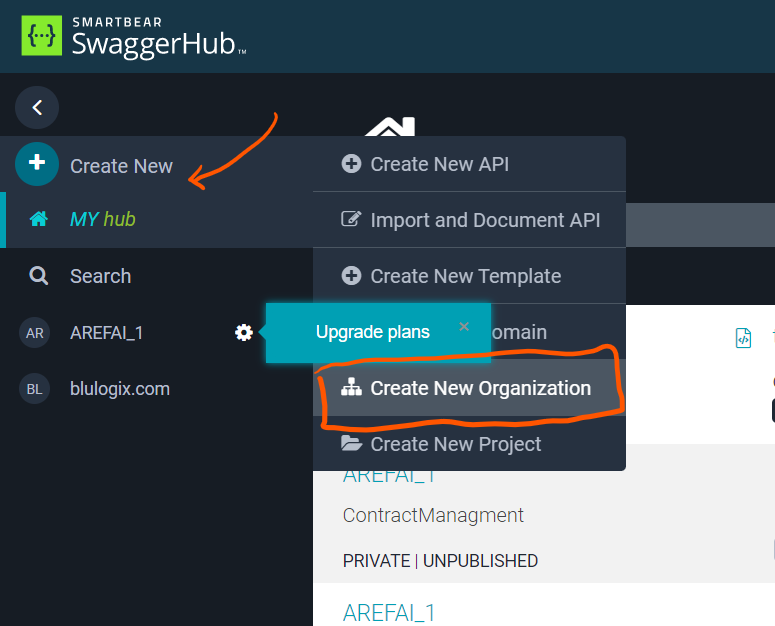
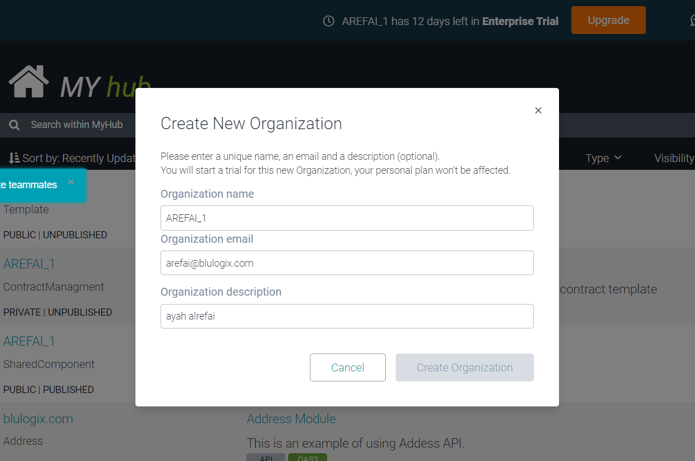
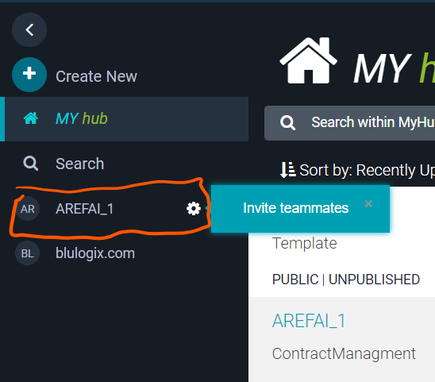

# Create Organization

## Note 

- SaaS accounts typically have only one organization which was created when the account was set up. On-Premise installations may have multiple organizations.

- Organizations are billed separately from personal accounts. Every organization requires a paid plan based on the number of users and features you want to use. New organizations start with a free 14-day trial, no credit card is required. After the trial period expires, choose a plan that best suits your organization needs.

- SwaggerHub On-Premise 1.19.2 and later have a concept of a default organization. The default organization is created automatically during installation or upgrade.

هلأ ممكن اكون شغاله لأكثر من org
 
فممكن كل org أعمللها org خاصة فيها و تحتها كل API's

## Steps

