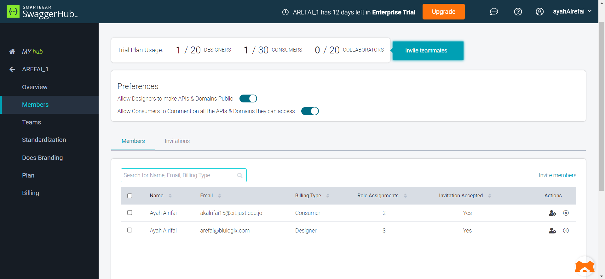
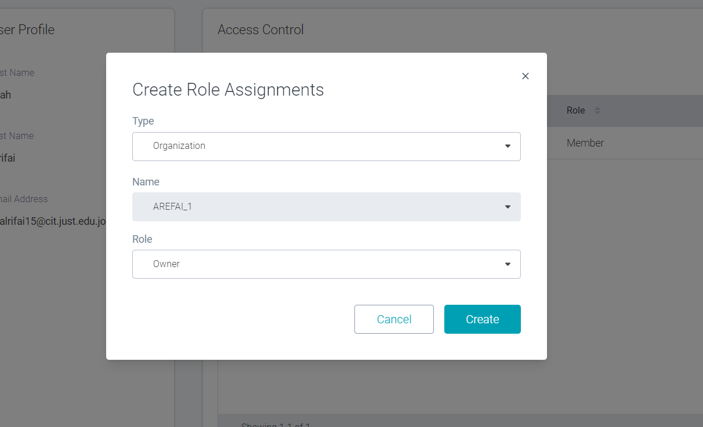
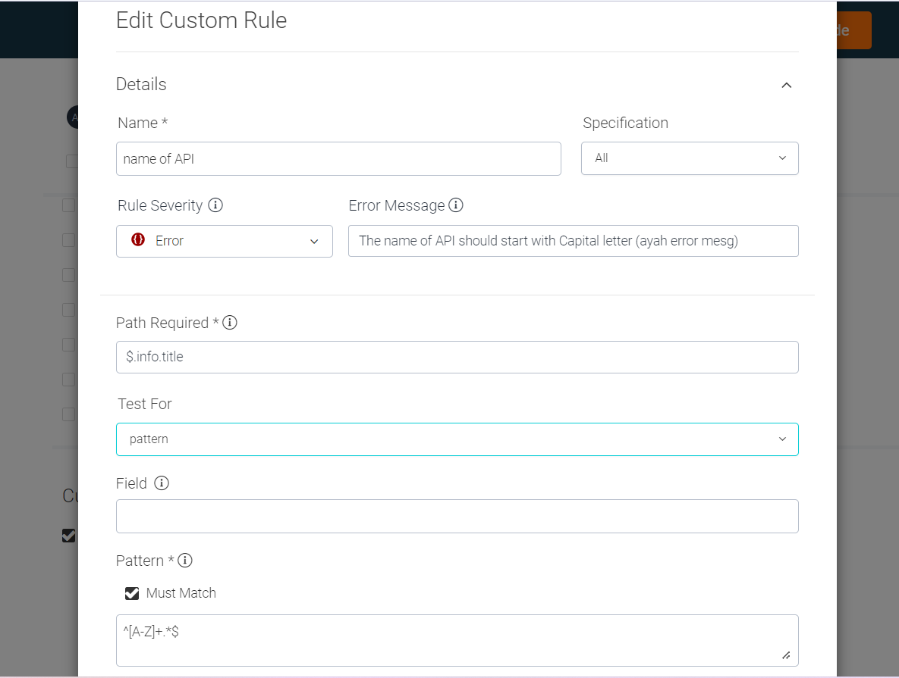
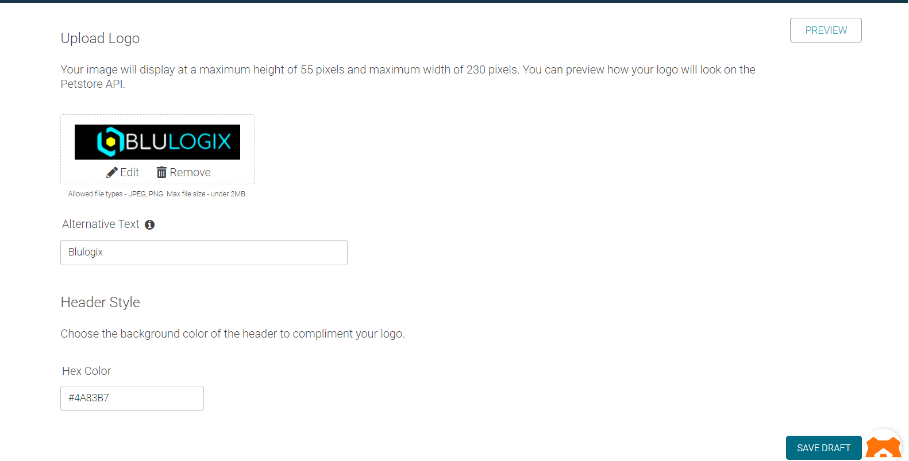
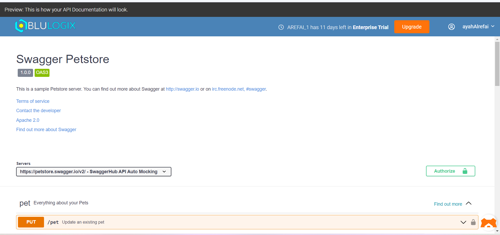

# Organization Settings

## Members 

- you can add many members under organization 
- click on setting icon side to organization name 
- add new member by email or user name
- you can manage role for member by click on Member profile action
- you can add role or edit current role

### Type:
- Team

بكون اله access على كل اشي جوا الTeam

- Organization

بكون اله access على كل اشي جوا الOrganization

- domain

بكون اله access على domain معين

- API

بكون اله access على API معينه

### Name:

هو عبارة عن list ال value يلي اله حسب 
الType
 
يعني مثلا لو كان الtype -> domain رح تظهر list of domains داخل هاي الOrg و منها بختار
 
ونفس الاشي لباقي الTypes

### Role:
- Team: [Admenistartor, mmember]
    - adminstration
    

    اله access على كل الpublic API, domains and template
      
    لكن فقط read only.
     
    بيقدر يعمل create ل API and Domain
     
    اله access على org settings -> team
    

    - member
    

    اله access على كل الpublic API, domains and template
      
    لكن فقط read only.
     
    بيقدر يعمل create ل API and Domain
    

- Organization [owner, customer, designer]
    - owner:
    

    بكون اله access على كل اشي جوا الorg و بيقدر يعمل create لأي اشي او يعمل edit او delete
     
    واله access على org settings 
    

    - designer
    

    بيقدر يعمل create API or Domain
     
    بيقدر يعمل تعديل على اي API or Domain
    

    - customer
    

   فقط read only
    

- domain [designer, customer]
    - designer
    

    بيقدر يعمل create domain
     
    و بيعمل edit على الdomain يلي ماخذ عليه access
    

    - customer
    

    اله access read only على الdomain يلي ماخذ عليه access
    

- API [designer, customer]
     - designer
    

    بيقدر يعمل create API
     
    و بيعمل edit على الAPI يلي ماخذ عليه access
    

    - customer
    

    اله access read only على الAPI يلي ماخذ عليه access
    

## Standardization

Build your internal standardization guide now. Choose from the list of rules below or add your own rules. Each rule will be applied to all the API definitions in your SwaggerHub Organization and will be validated each time a new API definition is saved to ensure design standards are being followed.

### create custom rule
the Title of API should start with capital letter

## Docs Branding
Upload a logo image to display in the header of your organization's published documentation

    بقدر من خلالها احدد الLogo يلي رح يظهر بال bar لما اعمل publish
     
    كما بقدر احدد لون الbar

