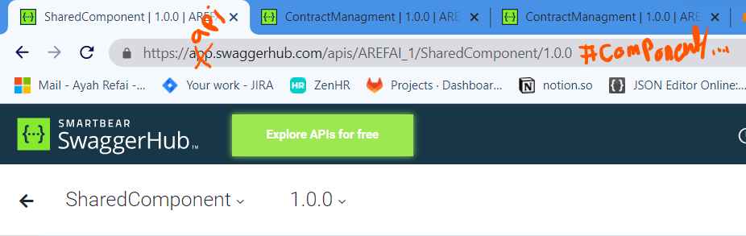
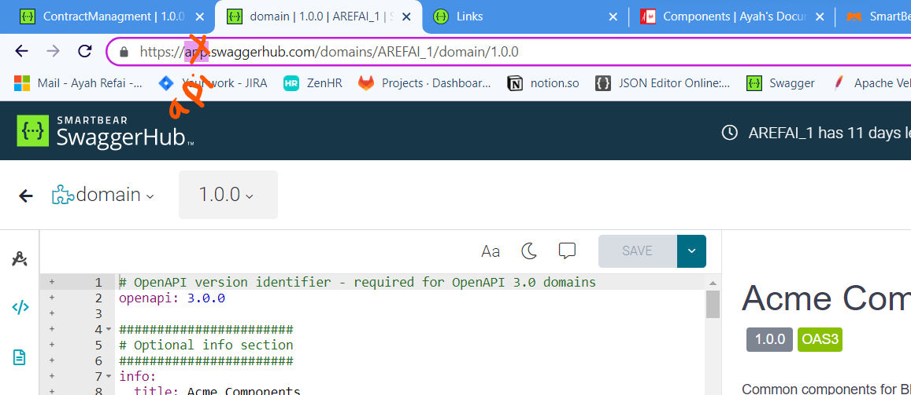
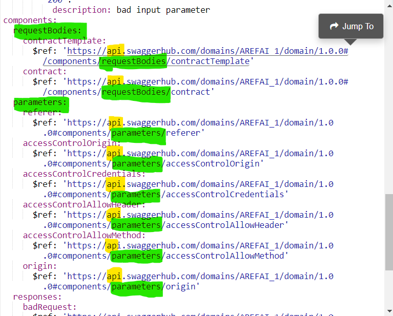

# Externally Defined Components

## from API
```yaml
components:
  schemas:
    Pet:
      $ref: '../models/pet.yaml'
      # Can now use use '#/components/schemas/Pet' instead
    User:
      $ref: 'https://api.example.com/v2/openapi.yaml#/components/schemas/User'
      # Can now use '#/components/schemas/User' instead
  responses:
    GenericError:
      $ref: '../template-api.yaml#/components/responses/GenericError'
      # Can now use '#/components/responses/GenericError' instead
```



## from domain

```yaml
components:
  requestBodies:
    contractTemplate:
      $ref: 'https://api.swaggerhub.com/domains/AREFAI_1/domain/1.0.0#/components/requestBodies/contractTemplate'
    contract:
      $ref: 'https://api.swaggerhub.com/domains/AREFAI_1/domain/1.0.0#/components/requestBodies/contract'
  parameters:
    referer: 
      $ref: 'https://api.swaggerhub.com/domains/AREFAI_1/domain/1.0.0#components/parameters/referer'
    accessControlOrigin:
      $ref: 'https://api.swaggerhub.com/domains/AREFAI_1/domain/1.0.0#components/parameters/accessControlOrigin'
```



