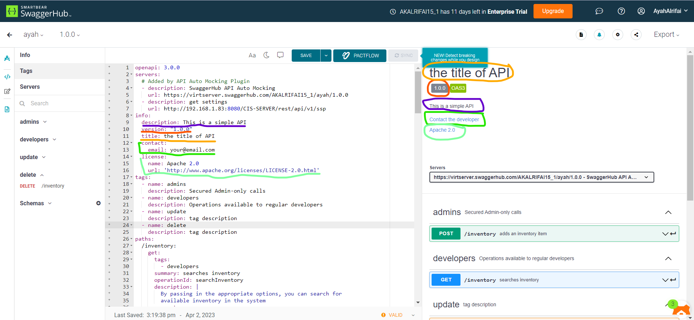

# Info



title is your API name. description is extended information about your API. It can be multiline and supports the CommonMark dialect of Markdown for rich text representation. HTML is supported to the extent provided by CommonMark. version is an arbitrary string that specifies the version of your API. info also supports other keywords for contact information, license, terms of service, and other details.

- description: This is Description about this API 
- version: it is the version of API " API can be change so when change it we will make a new version of it"
- title: the name of API such as setting, contract, order, cycle
- contact: email: the email to contact with blulogix
- license: name and url "is it important?"

```yaml
  info:
    description: This is a simple API 
    version: "1.0.0"
    title: the title of API
    contact:
      email: your@email.com
    license:
      name: Apache 2.0
      url: 'http://www.apache.org/licenses/LICENSE-2.0.html'
```
