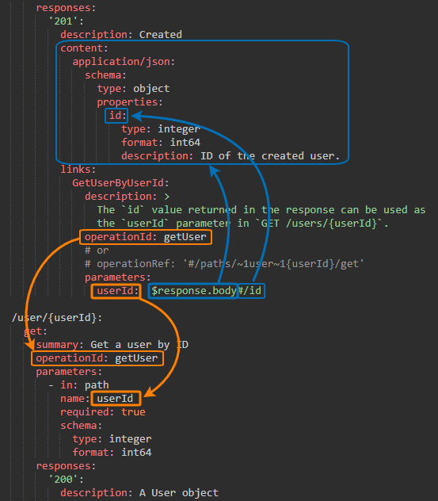

# Link

## Defining Links

Links are defined in the links section of each response:

```yaml
      responses:
        '200':
          description: Created
          content:
            ...
          links:   # <----
            ...
        '400':
          description: Bad request
          content:
            ...
          links:   # <----
            ...
```
## Full Example

```yaml
openapi: 3.0.0
info:
  version: 0.0.0
  title: Links example
paths:
  /users:
    post:
      summary: Creates a user and returns the user ID
      operationId: createUser
      requestBody:
        required: true
        description: A JSON object that contains the user name and age.
        content:
          application/json:
            schema:
              $ref: '#/components/schemas/User'
      responses:
        '201':
          description: Created
          content:
            application/json:
              schema:
                type: object
                properties:
                  id:
                    type: integer
                    format: int64
                    description: ID of the created user.
          # -----------------------------------------------------
          # Links
          # -----------------------------------------------------
          links:
            GetUserByUserId:   # <---- arbitrary name for the link
              operationId: getUser
              # or
              # operationRef: '#/paths/~1users~1{userId}/get'
              parameters:
                userId: '$response.body#/id'
              description: >
                The `id` value returned in the response can be used as
                the `userId` parameter in `GET /users/{userId}`.
          # -----------------------------------------------------
  /users/{userId}:
    get:
      summary: Gets a user by ID
      operationId: getUser
      parameters:
        - in: path
          name: userId
          required: true
          schema:
            type: integer
            format: int64
      responses:
        '200':
          description: A User object
          content:
            application/json:
              schema:
                $ref: '#/components/schemas/User'
components:
  schemas:
    User:
      type: object
      properties:
        id:
          type: integer
          format: int64
          readOnly: true
        name:
          type: string
```



### operationId 
If the target operation has operationId specified, the link can point to this ID – as in the image above. This approach can be used for local links only, because the operationId values are resolved in the scope of the current API specification.

### operationRef
operationRef can be used when operationId is not available. operationRef is a reference to the target operation using the JSON Reference syntax – same as used by the $ref keyword. References can be local (within the current API specification):
```yaml
operationRef: '#/paths/~1users~1{userId}/get'
```
or external:
```yaml
operationRef: 'https://anotherapi.com/openapi.yaml#/paths/~1users~1{userId}/get'
operationRef: './operations/getUser.yaml'
```
Here, the string #/paths/~1users~1{userId}/get actually means #/paths//users/{userId}/get, but the inner slashes / in the path name need to be escaped as ~1 because they are special characters.

```
#/paths/~1users~1{userId}/get
   │       │               │
   │       │               │
paths:     │               │
  /users/{userId}:         │
    get:  ─────────────────┘
      ...
```