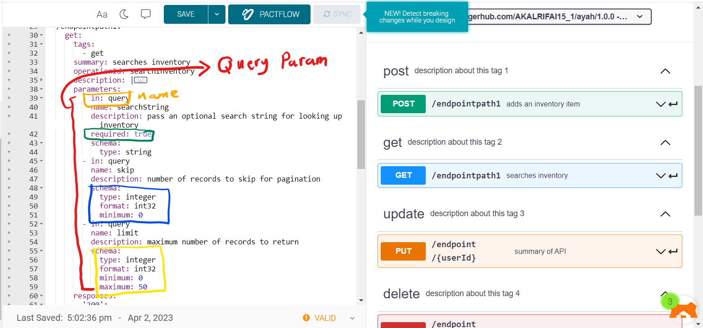
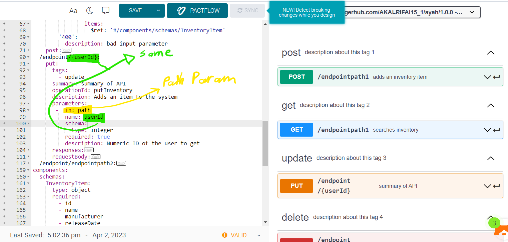

# Parameters

Operations can have parameters passed via URL path (/users/{userId}), query string (/users?role=admin), headers (X-CustomHeader: Value) or cookies (Cookie: debug=0). You can define the parameter data types, format, whether they are required or optional, and other details

- in: see below sections
- name: name of the param.
- description: description about the parameter.
- required: is the parameter requerd "true" or not "false".
- schema: the type and the format of parameter and can add some constraint such as minimux, maximum and default [more about Schema](https://swagger.io/docs/specification/data-models/)

---

## Query Parameters



in: the type of parameter "query -> query param" such as ?id=x ?name=xxx&age=x where id, name, age are "in"

```yaml
 parameters:
        - in: query
          name: searchString
          description: pass an optional search string for looking up inventory
          required: true
          schema:
            type: string
        - in: query
          name: skip
          description: number of records to skip for pagination
          schema:
            type: integer
            format: int32
            minimum: 0
        - in: query
          name: limit
          description: maximum number of records to return
          schema:
            type: integer
            format: int32
            minimum: 0
            maximum: 50
```

---

## Path Parameters



in: the type of parameter "path -> path param" such as /${name}/${id} name and id are path params

```yaml
/endpoint/{userId}:
    put:
      .
      .
      .
      parameters:
       -  in: path
          name: userId
          schema:
            type: integer
          required: true
          description: Numeric ID of the user to get
```

---

## Header Parameters

An API call may require that custom headers be sent with an HTTP request. OpenAPI lets you define custom request headers as in: header parameters. For example, suppose, a call to GET /ping requires the X-Request-ID header:

```
GET /ping HTTP/1.1
Host: example.com
X-Request-ID: 77e1c83b-7bb0-437b-bc50-a7a58e5660ac
```

Using OpenAPI 3.0, you would define this operation as follows:

```yaml
paths:
  /ping:
    get:
      summary: Checks if the server is alive
      parameters:
        - in: header
          name: X-Request-ID
          schema:
            type: string
            format: uuid
          required: true
```

In a similar way, you can define custom response headers. Header parameter can be primitives, arrays and objects. Arrays and objects are serialized using the simple style

Note: Header parameters named Accept, Content-Type and Authorization are not allowed. To describe these headers, use the corresponding OpenAPI keywords

---

## Cookie Parameters

Operations can also pass parameters in the Cookie header, as Cookie: name=value. Multiple cookie parameters are sent in the same header, separated by a semicolon and space.

```yaml
GET /api/users
Host: example.com
Cookie: debug=0; csrftoken=BUSe35dohU3O1MZvDCUOJ
```

Use in: cookie to define cookie parameters:

```yaml
      parameters:
        - in: cookie
          name: debug
          schema:
            type: integer
            enum: [0, 1]
            default: 0
        - in: cookie
          name: csrftoken
          schema:
            type: string
```
