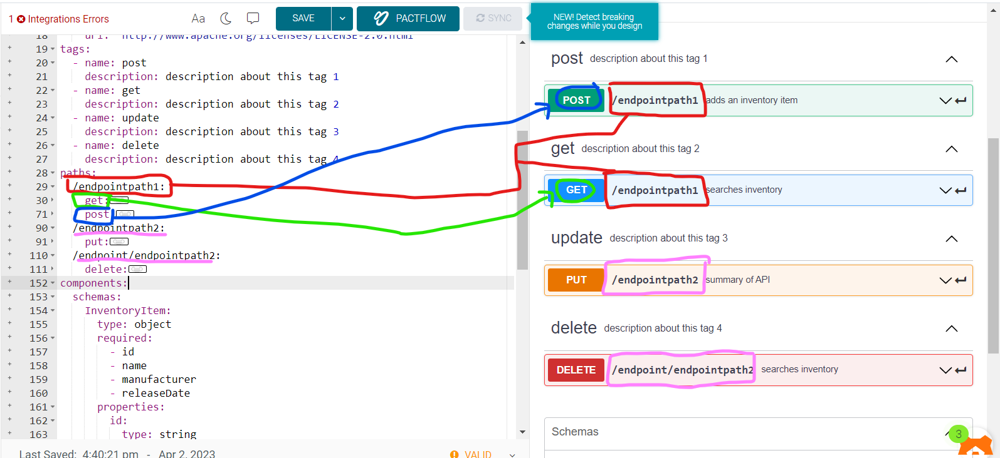
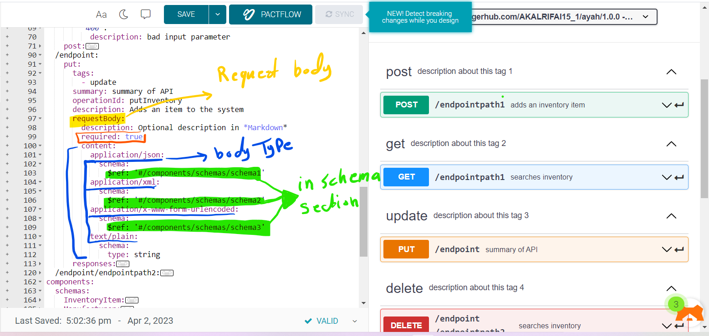
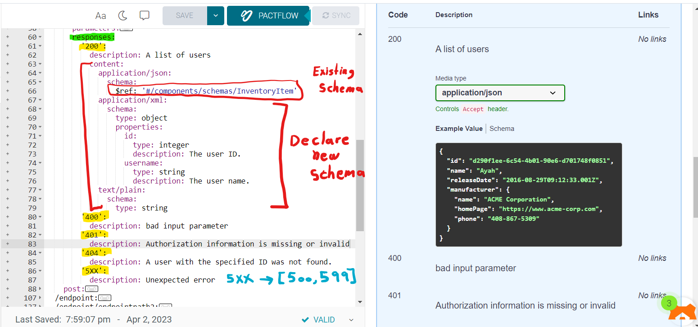
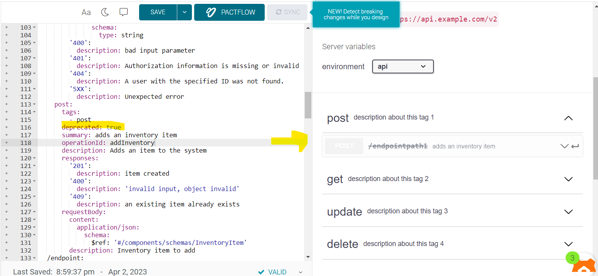

# Paths

The paths section defines individual endpoints (paths) in your API, and the HTTP methods (operations) supported by these endpoints

---

## Endpoint Path



- we will start with endpoint path such as /user , /user/order ,....so on.
- then we will set the HTTP METHOD such as get, post, put, delete 
- can not duplicate method in the same endpoint path
```
                  https://api.example.com/v1/users?role=admin&status=active
                    \________________________/\____/ \______________________/
                          server URL          endpoint    query parameters
                                                path
```

---

## HTTP Method


- Tag: same as tags that declare in Tag properity
- summary, description 
- operationId: is an optional unique string used to identify an operation. If provided, these IDs must be unique among all operations described in your API.

```yaml
paths:
  /endpointpath1:
    get:
      tags:
        - get
      summary: searches inventory
      operationId: searchInventory
      description: |
        By passing in the appropriate options, you can search for
        available inventory in the system
```
---

## Parameters

Operations can have parameters passed via URL path (/users/{userId}), query string (/users?role=admin), headers (X-CustomHeader: Value) or cookies (Cookie: debug=0). You can define the parameter data types, format, whether they are required or optional, and other details.

:::info

 learn more about parameters [link](../parameters)

:::
---

## RequestBody



If an operation sends a request body, use the requestBody keyword to describe the body content and media type.

- description
- required: is the body requerd "true" or not "false".
- content: has the type of the body such as xml, json,...
- content: application/json: schema: the data model of the value [read about schema](../components/#schemas)

```yaml
/endpoint/{userId}:
    requestBody:
        description: Optional description in *Markdown*
        required: true
        content:
          application/json:
            schema:
              $ref: '#/components/schemas/schema1'
          application/xml:
            schema:
              $ref: '#/components/schemas/schema2'
          application/x-www-form-urlencoded:
            schema:
              $ref: '#/components/schemas/schema3'
          text/plain:
            schema:
              type: string
```

---

## Responses



For each operation, you can define possible status codes, such as 200 OK or 404 Not Found, and the response body schema. Schemas can be defined inline or referenced via $ref.

- each statusCode is an object inside responses.
- each status has description.
- may status has a content.
- X  in status code mean any number between 0 and 9

```yaml
responses:
        '200':
          description: A list of users
          content:
            application/json:
              schema:
                $ref: '#/components/schemas/InventoryItem'
            application/xml:
              schema:
                type: object
                properties:
                  id:
                    type: integer
                    description: The user ID.
                  username:
                    type: string
                    description: The user name.
            text/plain:
              schema:
                type: string
        '400':
          description: bad input parameter
        '401':
          description: Authorization information is missing or invalid
        '404':
          description: A user with the specified ID was not found.
        '5XX':
          description: Unexpected error
```

---

## Deprecated Operations
You can mark specific operations as deprecated to indicate that they should be transitioned out of usage:



```yaml
 post:
      tags:
        - post
      deprecated: true
      summary: adds an inventory item
      operationId: addInventory
      description: Adds an item to the system
```

---

## Overriding Global Servers

The global servers array can be overridden on the path level or operation level. This is useful if some endpoints use a different server or base path than the rest of the API. Common examples are:

- Different base URL for file upload and download operations.
- Deprecated but still functional endpoints.

```yaml
servers:
  - url: https://api.example.com/v1
paths:
  /files:
    description: File upload and download operations
    servers:
      - url: https://files.example.com
        description: Override base path for all operations with the /files path
    ...
  /ping:
    get:
      servers:
        - url: https://echo.example.com
          description: Override base path for the GET /ping operation
```

---

## [more Information](https://swagger.io/docs/specification/describing-parameters/)