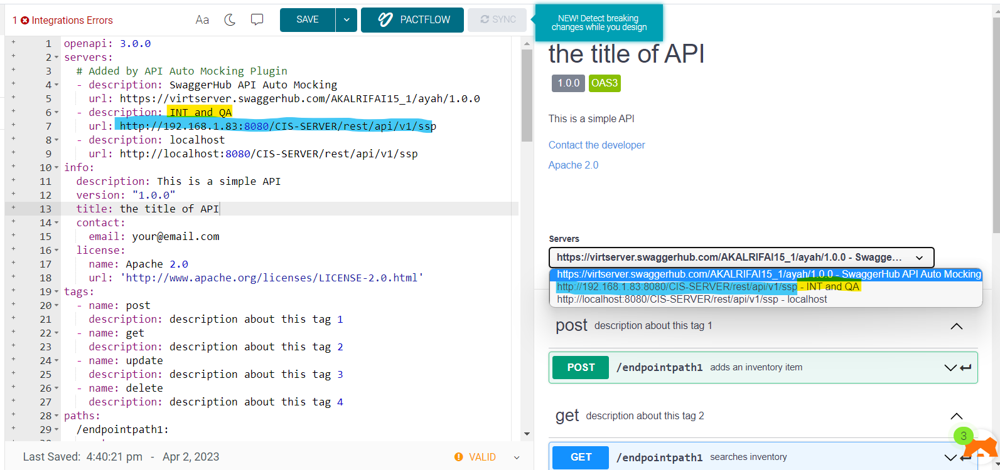

# Servers



The servers section specifies the API server and base URL. You can define one or several servers, such as production and sandbox.

- can has many servers such as integration, stag, production,...so on
- each server has description and url
- there is an initial server will be added auto
```
                        https://api.example.com/v1/users?role=admin&status=active
                          \________________________/\____/ \______________________/
                                server URL          endpoint    query parameters
                                                      path
```
```yaml
servers:
  # Added by API Auto Mocking Plugin
  - description: SwaggerHub API Auto Mocking
    url: https://virtserver.swaggerhub.com/AKALRIFAI15_1/ayah/1.0.0
  - description: INT and QA
    url: http://192.168.1.83:8080/CIS-SERVER/rest/api/v1/ssp
  - description: localhost
    url: http://localhost:8080/CIS-SERVER/rest/api/v1/ssp
```

---

## Server Templating

- customerId: is a text box.
- port: is a list box

```yaml
  - url: https://{customerId}.saas-app.com:{port}/v2
    variables:
      customerId:
        default: demo
        description: Customer ID assigned by the service provider
      port:
        enum:
          - '443'
          - '8443'
        default: '443'
```