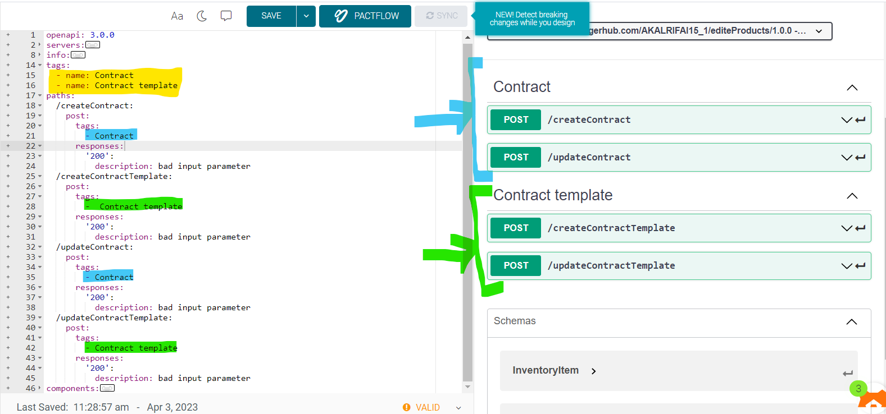

# Tags



Grouping Operations With Tags
You can assign a list of tags to each API operation. Tagged operations may be handled differently by tools and libraries. For example, Swagger UI uses tags to group the displayed operations.

- can has many tags each tag has name and description
- the name of tag we will use it on paths 

    ```yaml
      tags:
      - name: post
        description: description about this tag 1
        externalDocs:
          url: http://docs.my-api.com/pet-operations.htm
      - name: get
        description: description about this tag 2
      - name: update
        description: description about this tag 3
      - name: delete
        description: description about this tag 4
    ```
<div dir="auto">
    ممكن أستغني عن Tags 
    و استخدمهم مباشرة جوا الPaths
</div>
