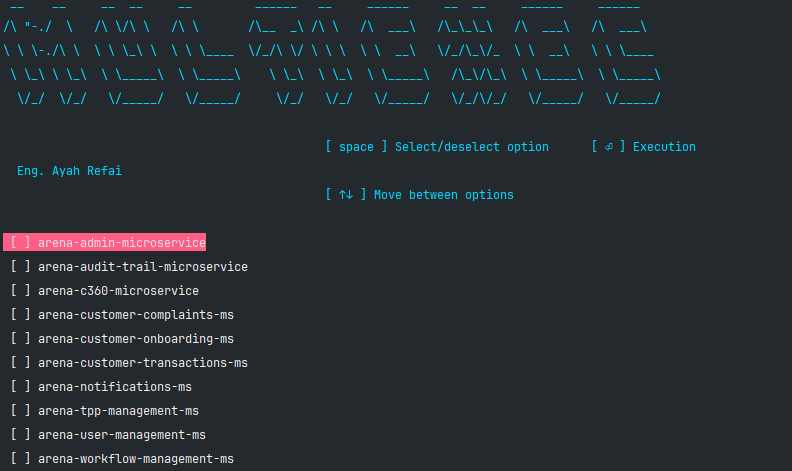

# MultiExecPro



**🚀 Empower Your Workflow with MultiExecPro: Simplifying Microservices Management with PowerShell 🚀**


As software development continues to evolve, the adoption of microservices architecture has become increasingly prevalent. While microservices offer numerous benefits such as scalability and flexibility, managing multiple microservices can present a unique set of challenges for developers. Imagine the scenario: you have a suite of microservices, each residing in its own folder, and you need to execute the same action across all of them. What would typically be a tedious and time-consuming task can now be effortlessly streamlined, thanks to MultiExecPro.


Developed with the mission of simplifying microservices management, MultiExecPro is a PowerShell tool that empowers developers to execute commands across multiple folders with ease. Whether it's updating dependencies, running tests, or deploying changes, MultiExecPro provides a seamless solution for performing repetitive tasks across distributed microservices architectures.


**🔗 Access the Tool: [GitHub Repository](https://github.com/AyahAlrifai/MultiExecPro)**


## How does it work?


1. Download and Setup: Start by downloading the `multiExecPro.ps1` file and placing it in the directory containing all the microservices or folders you wish to manage.


2. Permissions: Open PowerShell and run `Set-ExecutionPolicy -Scope Process -ExecutionPolicy Bypass` to ensure smooth execution.

```powershell
Set-ExecutionPolicy -Scope Process -ExecutionPolicy Bypass
```

3. Execution: Navigate to the location of `multiExecPro.ps1` in PowerShell and execute it by running ``./multiExecPro.ps1`.

```powershell
./multiExecPro.ps1
```

4. Command Input: Enter your desired commands separated by `&&` when prompted. These commands will be executed sequentially on each selected microservice.


5. Microservice Selection: Browse through the displayed list of microservice folders, using the `arrow keys` to navigate and the spacebar to select or deselect.


6. Execution Control: Initiate the execution process by hitting `enter`. MultiExecPro will carry out the specified commands on the selected microservices, maintaining the order of selection.


7. Completion and Termination: Upon completion, press `enter` to return to the command screen. You can also exit the process by inputting `n` or `N` followed by enter. At any point, `Ctrl+C` can be used to cancel the process.


## Key Features:

- Simplified management across multiple microservices.

- Intuitive selection interface with command history.

- Seamless execution of user-defined commands.


Experience the efficiency and ease of MultiExecPro today, and witness firsthand how it revolutionizes your microservices management workflow.