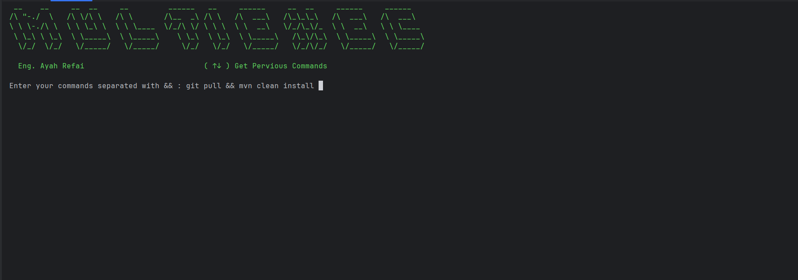
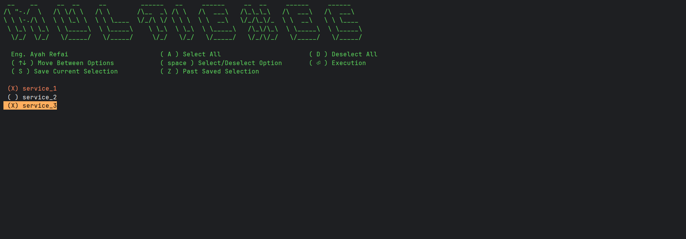

# MultiExecPro





# 1. Overview

This PowerShell script provides an **interactive terminal menu** that allows users to:

* Select one or multiple project directories
* Execute commands on selected projects
* Save and restore selections
* Navigate using keyboard shortcuts
* Run batch commands separated by `&&`

The script is designed for developers who manage **multiple repositories or microservices** and need to run commands such as:

* `git pull`
* `mvn clean install`
* `npm install`
* `docker build`
* `gradle build`

---

# 2. Features

## 2.1 Interactive Project Selection

The script automatically detects project folders:

```powershell
$projects = Get-ChildItem -Directory -Exclude .* | ForEach-Object { $_.Name }
```

It:

* Reads all directories
* Ignores hidden folders (starting with ".")
* Displays them as selectable options

---

## 2.2 Multi-Selection Menu

The menu allows:

* Selecting multiple projects
* Selecting all projects
* Deselecting all
* Saving selection
* Restoring selection

Example:

```
(X) project-A
( ) project-B
(X) project-C
```

---

## 2.3 Batch Command Execution

Users enter commands like:

```
git pull && mvn clean install
```

The script splits commands:

```powershell
$commands = $userCommands -split "&&"
```

Each command runs sequentially.

---

# 3. Script Flow

## Step 1 — Start Script

```
Start_Script
```

The script:

1. Displays banner
2. Asks user for commands
3. Opens project selection menu

---

## Step 2 — Enter Commands

Example input:

```
git pull && mvn clean install
```

Supported:

```
npm install && npm run build
```

```
git fetch && git reset --hard origin/main
```

---

## Step 3 — Select Projects

Menu appears:

```
(X) service-auth
( ) service-user
(X) service-payment
```

---

## Step 4 — Execute Commands

Script enters each project folder:

```
cd ./service-auth
```

Runs commands:

```
git pull
mvn clean install
```

Returns:

```
cd ../
```

---

## Step 5 — Continue or Exit

User prompt:

```
Do you want to continue? [N] No
```

* Press `N` → Exit
* Press anything else → Restart

---

# 4. Keyboard Controls

## Navigation

| Key   | Action            |
| ----- | ----------------- |
| ↑     | Move Up           |
| ↓     | Move Down         |
| Space | Select / Deselect |
| Enter | Execute           |

---

## Selection Shortcuts

| Key | Action            |
| --- | ----------------- |
| A   | Select All        |
| D   | Deselect All      |
| S   | Save Selection    |
| Z   | Restore Selection |

---

## Command History

| Key | Action            |
| --- | ----------------- |
| ↑ ↓ | Previous commands |

---

# 5. User Guide

## Step 1 — Open PowerShell

Navigate to your workspace folder:

Example:

```powershell
cd D:\workspaces
```

---

## Step 2 — Run Script

```
.\multiExecPro.ps1
```

---

## Step 3 — Enter Commands

Example:

```
git pull && mvn clean install
```

Press Enter.

---

## Step 4 — Select Projects

Use:

* Arrow keys
* Space

Example:

```
(X) auth-service
(X) user-service
( ) payment-service
```

Press Enter.

---

## Step 5 — Watch Execution

Example output:

```
~~~~~~~~~~~~~~~~~~~~~~~~
auth-service
~~~~~~~~~~~~~~~~~~~~~~~~

cd ./auth-service
git pull
mvn clean install

cd ../
```

---

# 6. Functions Documentation

# 6.1 Start_Script()

## Purpose

Main script controller.

## Responsibilities

* Show header
* Read user commands
* Call menu
* Execute commands
* Repeat execution

## Workflow

```
User Input → Project Selection → Command Execution → Repeat
```

---

# 6.2 Show-Menu()

## Purpose

Interactive project selector.

## Input

```
[string[]] Options
```

Example:

```
project1
project2
project3
```

## Output

Returns:

```
array of selected indexes
```

Example:

```
0
2
3
```

---

## Internal Variables

### selectedOption

Current cursor position.

Example:

```
selectedOption = 2
```

---

### selectedItems

Hashtable of selected projects.

Example:

```
{
 0 = projectA
 2 = projectC
}
```

---

### list

Array of selected indexes.

Example:

```
0,2
```

---

# 6.3 Write-ColorText()

## Purpose

Print colored text.

## Example

```
Write-ColorText "Hello" -Color 77
```

---

## Uses ANSI colors

```
ESC[38;5;COLORm
```

---

# 6.4 Write-ColorTextBackground()

## Purpose

Print colored text with background.

## Example

```
Write-ColorTextBackground "Selected" -ForegroundColor 0 -BackgroundColor 215
```

---

# 7. Visual Interface

## Banner

```
 __    __     __  __     __         ______
...
```

Shows:

```
Eng. Ayah Refai
```

---

## Menu Example

```
(X) service-auth
( ) service-user
(X) service-payment
```

Legend:

```
(X) Selected
( ) Not Selected
```

---

# 8. Color Configuration

Colors:

```
$primaryColor = 77
$secondaryColor = 215
$thirdColor = 209
$whiteBlackColor = 255
```

Meaning:

| Variable        | Usage                    |
| --------------- | ------------------------ |
| primaryColor    | Headers                  |
| secondaryColor  | Selected item background |
| thirdColor      | Selected text            |
| whiteBlackColor | Normal text              |

---

# 9. Folder Structure Example

Example workspace:

```
workspace/
 ├── service-auth/
 ├── service-user/
 ├── service-payment/
 └── script.ps1
```

Script automatically detects:

```
service-auth
service-user
service-payment
```

---

# 10. Example Use Cases

## 10.1 Git Pull All Services

```
git pull
```

Press:

```
A → Enter
```

---

## 10.2 Build Selected Services

```
mvn clean install
```

Select:

```
service-auth
service-payment
```

---

## 10.3 Install Node Packages

```
npm install && npm run build
```

---

# 11. Error Handling

Script uses:

```
try/catch
```

Example:

```
catch
{
    Write-Host "Script terminated."
}
```

Prevents crashes.

---

# 12. Limitations

### 1. No command validation

Invalid commands will fail.

Example:

```
git pulll
```

---

### 2. Commands run sequentially

No parallel execution.

---

### 3. Requires ANSI support

Modern PowerShell only.

---

# 13. Requirements

## Required Software

* PowerShell 5+ or PowerShell 7+

Check version:

```
$PSVersionTable.PSVersion
```

---

# 14. Security Warning

Script uses:

```
Invoke-Expression
```

Example:

```
Invoke-Expression -Command $trimmedCommand
```

This executes **raw commands**.

⚠ Only use trusted commands.

---

# 15. Best Practices

Recommended commands:

```
git pull
```

```
mvn clean install
```

```
docker compose build
```

Avoid:

```
Remove-Item -Recurse *
```

---

# 16. Advanced Usage

## Save Selection

Press:

```
S
```

Selection stored in memory.

---

## Restore Selection

Press:

```
Z
```

Previous selection restored.

---

**🔗 Access the Tool: [GitHub Repository](https://github.com/AyahAlrifai/MultiExecPro)**


## How does it work?

1. Download and Setup: Start by downloading the `multiExecPro.ps1` file and placing it in the directory containing all the microservices or folders you wish to manage.


2. Permissions: Open PowerShell and run `Set-ExecutionPolicy -Scope Process -ExecutionPolicy Bypass` to ensure smooth execution.
