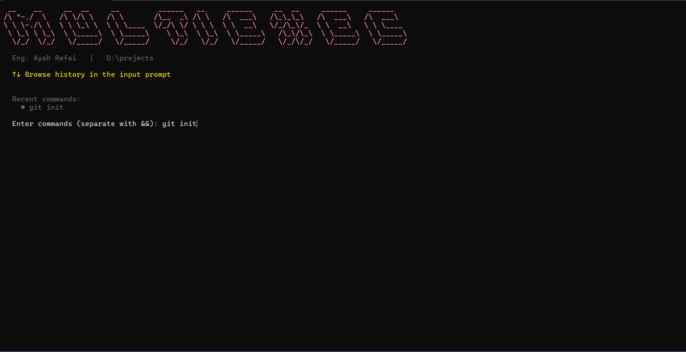
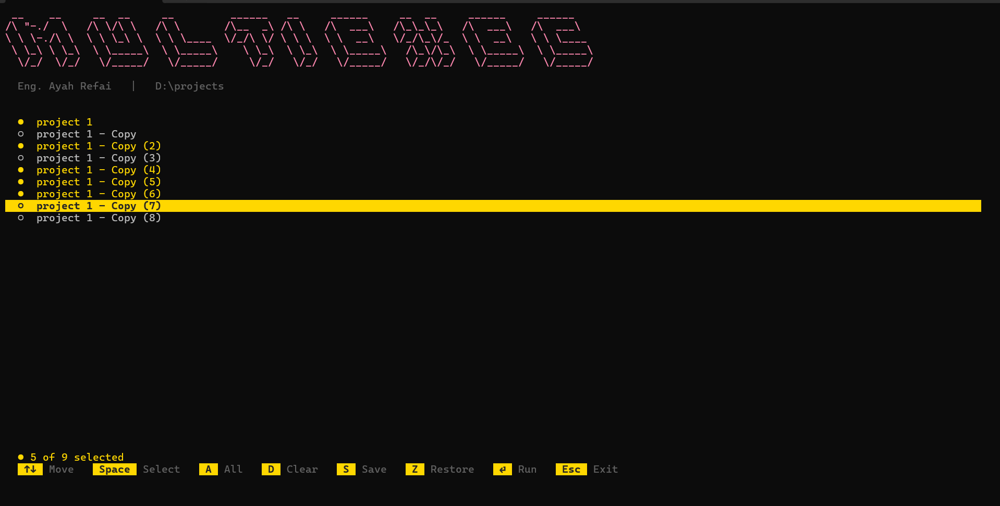
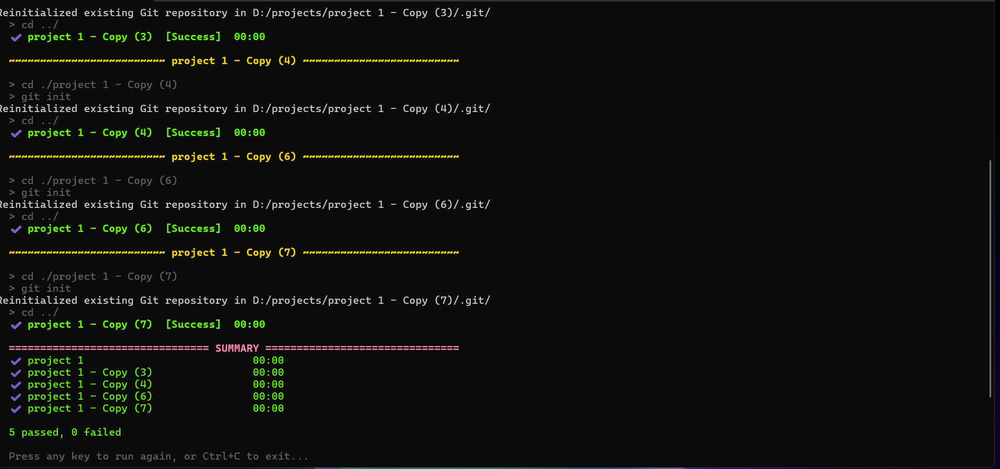

# MultiExecPro

A PowerShell CLI tool that lets you run any command across multiple project folders at once — interactively, with a beautiful terminal UI.

Built by **Eng. Ayah Refai**.





---

## ✨ Features

- 🗂️ Auto-detects all subfolders in your current directory as "projects"
- ☑️ Interactive multi-select menu — pick one, many, or all projects
- ⚡ Run any command (or chain multiple with `&&`) across all selected projects
- 📋 Per-project live output with success/failure status
- 📊 Summary report at the end showing passed, failed, and elapsed time
- 🕘 Command history — reuse recent commands quickly
- 💾 Save & restore project selections within a session
- 🌗 Auto-detects Windows dark/light mode for theme

---

## 📋 Requirements

- **PowerShell 5.1** or higher (Windows PowerShell or PowerShell 7+)
- **Windows / Linux / macOS**
- Internet connection (for installation only)

---

## 🚀 Installation

Open a terminal and run **one command**:

### Windows (PowerShell)

```powershell
irm https://raw.githubusercontent.com/AyahAlrifai/MultiExecPro/main/install.ps1 | iex
```

### Linux / macOS

```bash
pwsh -c "irm https://raw.githubusercontent.com/AyahAlrifai/MultiExecPro/main/install.ps1 | iex"
```

> **Note for Linux/macOS:** PowerShell (`pwsh`) must be installed first.
> - Ubuntu/Debian: `sudo apt-get install -y powershell`
> - macOS: `brew install --cask powershell`

The installer will automatically:

| Step | What happens |
|------|-------------|
| 📁 Create folder | `~/.multiexecpro` (Linux/Mac) or `%USERPROFILE%\.multiexecpro` (Windows) |
| ⬇️ Download script | Latest version from GitHub |
| 🛣️ Add to PATH | So you can run it from anywhere |
| ⚙️ Register command | Adds `multiExecPro` to your shell profile |
| 🔓 Fix permissions | Sets execution policy on Windows automatically |

After installation, **open a new terminal window** and you're ready.

---

## 📖 Usage

### Step 1 — Navigate to your projects folder

```powershell
cd D:\my-projects
```

Your folder structure should look like this:

```
my-projects/
├── project-a/
├── project-b/
└── project-c/
```

### Step 2 — Run the tool

```powershell
multiExecPro
```

### Step 3 — Enter a command

Type any shell command you want to run. Use `&&` to chain multiple commands:

```
mvn clean install
```
```
git pull && mvn clean install
```
```
npm install && npm run build
```

### Step 4 — Select projects

An interactive menu appears showing all subfolders. Use the keyboard to select which projects to run the command on:

| Key | Action |
|-----|--------|
| `↑` / `↓` | Move cursor up/down |
| `Space` | Select / deselect project |
| `A` | Select all projects |
| `D` | Clear all selections |
| `S` | Save current selection for later |
| `Z` | Restore previously saved selection |
| `Enter` | Run command on selected projects |
| `Esc` | Go back / exit menu |

### Step 5 — View results

The tool runs your command inside each selected project folder, shows live output, then displays a summary:

```
✔  project-a                            00:12
✔  project-b                            00:08
✘  project-c                            00:03

  3 passed, 1 failed
```

### Step 6 — Run again or exit

After execution, press any key to run another command, or `Ctrl+C` to exit.

---

## 💡 Examples

**Pull latest changes in all projects:**
```
git pull
```

**Build all Maven projects:**
```
mvn clean install -DskipTests
```

**Install dependencies and build all Node projects:**
```
npm install && npm run build
```

**Run multiple git operations:**
```
git fetch && git pull && git status
```

---

## 🔄 Update

To get the latest version, simply run the installer again:

```powershell
irm https://raw.githubusercontent.com/AyahAlrifai/MultiExecPro/main/install.ps1 | iex
```

---

## 🗑️ Uninstall

### Windows
```powershell
Remove-Item -Recurse -Force "$env:USERPROFILE\.multiexecpro"
```
Then remove the `multiExecPro` function line from your PowerShell profile:
```powershell
notepad $PROFILE
```

### Linux / macOS
```bash
rm -rf ~/.multiexecpro
```
Then remove the `MultiExecPro` lines from `~/.zshrc` or `~/.bashrc`.

---

## 🐛 Troubleshooting

| Problem | Solution |
|---------|----------|
| `command not found: multiExecPro` | Open a **new** terminal after installation |
| `running scripts is disabled` | Run `Set-ExecutionPolicy RemoteSigned -Scope CurrentUser` as Admin |
| `No subdirectories found` | Make sure you `cd` into a folder that **contains** project subfolders |
| `pwsh: command not found` | Install PowerShell first (see Requirements above) |

---

## 📁 Repository

[https://github.com/AyahAlrifai/MultiExecPro](https://github.com/AyahAlrifai/MultiExecPro)