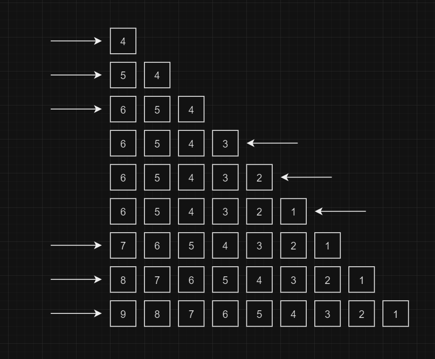
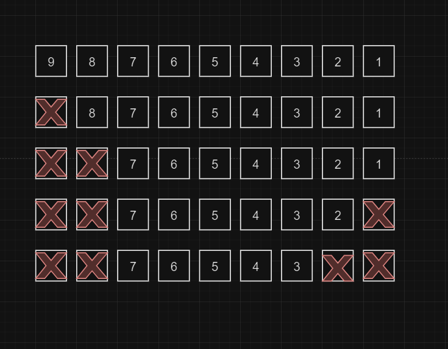

# LIST CMD


`LPUSH`, `RPUSH`, `LPOP`, and `RPOP` are fundamental commands in Redis used to manipulate lists. They are often used together to implement queue-like behavior or manage ordered data structures.

Here's a brief explanation of each command:

## LPUSH

The `LPUSH` command inserts one or multiple values at the beginning of a list. If the key does not exist, it will create a new list before performing the push operation.

```redis
LPUSH key value [value ...]
```

- `key`: The name of the list key.
- `value`: The value(s) to insert at the beginning of the list.


## RPUSH

The `RPUSH` command inserts one or multiple values at the end of a list. If the key does not exist, it will create a new list before performing the push operation.

```redis
RPUSH key value [value ...]
```

- `key`: The name of the list key.
- `value`: The value(s) to insert at the end of the list.

## LPOP

The `LPOP` command removes and returns the first element (leftmost element) of a list.

```redis
LPOP key
```

- `key`: The name of the list key.

## RPOP

The `RPOP` command removes and returns the last element (rightmost element) of a list.

```redis
RPOP key
```

- `key`: The name of the list key.

## EXAMPLE

```redis
127.0.0.1:6379> LPUSH LIST 4 5 6
(integer) 3
127.0.0.1:6379> RPUSH LIST 3 2 1
(integer) 6
127.0.0.1:6379> LPUSH LIST 7 8 9
(integer) 9
```



```redis
127.0.0.1:6379> lpop LIST 2
1) "9"
2) "8"
127.0.0.1:6379> RPOP LIST 2
1) "1"
2) "2"
```

