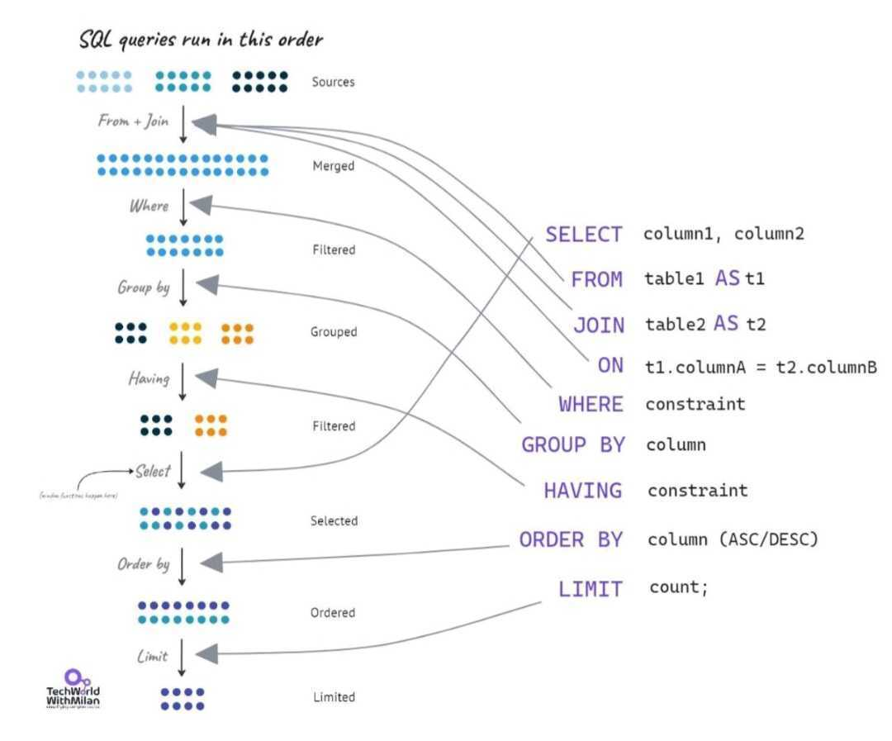

# Select Statemant

 


## **SELECT**  
The `SELECT` keyword is used to retrieve specific columns or data from a database table. It allows you to specify what data you want to fetch, such as all columns (`SELECT *`) or specific ones (`SELECT column1, column2`). This is the first step in most SQL queries.

### 1. **Basic Usage**  
   You can retrieve specific columns or all columns from a table.  
   ```sql
   SELECT column1, column2 FROM table_name;
   ```  
   - This fetches `column1` and `column2` from the specified table.  
   - To retrieve all columns, use `*`:  
     ```sql
     SELECT * FROM table_name;
     ```

### 2. **Column Aliases**  
   You can rename columns in the result set using aliases for better readability.  
   ```sql
   SELECT column1 AS alias_name FROM table_name;
   ```  
   For example, `SELECT first_name AS name FROM employees;` will display the column `first_name` as `name`.

### 3. **Expressions**  
   The `SELECT` statement allows you to perform calculations or apply functions on columns.  
   ```sql
   SELECT salary * 12 AS annual_salary FROM employees;
   ```  
   Here, the `SELECT` statement calculates the annual salary based on the `salary` column.

### 4. **Distinct Values**  
   To fetch unique values from a column, use the `DISTINCT` keyword.  
   ```sql
   SELECT DISTINCT column_name FROM table_name;
   ```  
   This removes duplicate rows for the specified column.

### 5. **Combining with Other Clauses**  
   The `SELECT` statement is often combined with other clauses to filter (`WHERE`), group (`GROUP BY`), sort (`ORDER BY`), or limit (`LIMIT`) the data.  
   Example:  
   ```sql
   SELECT name, age 
   FROM users 
   WHERE age > 30 
   ORDER BY age DESC 
   LIMIT 5;
   ```  
   This fetches the top 5 users older than 30, sorted by age in descending order.

### 6. **Subqueries**  
   You can use `SELECT` inside another query to retrieve data as part of a condition.  
   ```sql
   SELECT name 
   FROM employees 
   WHERE department_id = (SELECT id FROM departments WHERE name = 'IT');
   ```  
   Here, the inner `SELECT` retrieves the department ID for "IT", and the outer query fetches employees in that department.

---

## **FROM**  
The `FROM` keyword specifies the table from which the data should be retrieved. It defines the source of your query and works together with `SELECT` to determine where the data comes from.

### 1. **Basic Usage**  
The simplest form of the `FROM` clause is to specify a single table name:  
```sql
SELECT column1, column2 
FROM table_name;
```  
- Here, `table_name` is the name of the database table.  
- For example:  
  ```sql
  SELECT name, age 
  FROM employees;
  ```  
  This retrieves the `name` and `age` columns from the `employees` table.


### 2. **Using Aliases with Tables**  
Table aliases can make your queries more readable, especially when using long table names or joining multiple tables.  
```sql
SELECT e.name, d.department_name 
FROM employees e, departments d;
```  
- Here, `e` and `d` are aliases for the `employees` and `departments` tables, allowing you to reference them more easily.


### 3. **Joining Multiple Tables**  
The `FROM` clause can include multiple tables with different types of joins to combine data.  
- Example with `INNER JOIN`:  
  ```sql
  SELECT e.name, d.department_name 
  FROM employees e 
  INNER JOIN departments d 
  ON e.department_id = d.id;
  ```  
  This fetches employee names along with their department names by linking the two tables on a common column (`department_id`).


### 4. **Using Subqueries in FROM**  
You can use subqueries in the `FROM` clause to treat the result of a query as a temporary table.  
```sql
SELECT name, total_sales 
FROM (
  SELECT employee_id, SUM(sales) AS total_sales 
  FROM sales 
  GROUP BY employee_id
) AS sales_summary;
```  
- Here, the subquery calculates total sales for each employee, and the main query retrieves the employee name and total sales.


### 5. **Combining with Joins and Filters**  
When combined with `WHERE`, `GROUP BY`, and other clauses, the `FROM` clause serves as the foundation for querying data. For example:  
```sql
SELECT e.name, COUNT(p.project_id) AS total_projects 
FROM employees e 
LEFT JOIN projects p 
ON e.id = p.employee_id 
WHERE e.status = 'active' 
GROUP BY e.name;
```  
This query retrieves active employees and the total number of projects they are involved in.

--- 

## **JOIN**  
The `JOIN` (or  `INNER JOIN`) keyword is used to combine rows from two or more tables based on a related column. By joining tables, you can retrieve data spread across multiple tables and analyze it as a single dataset.

### **1. Basic Syntax**  
The syntax for an `INNER JOIN` looks like this:  
```sql
SELECT columns
FROM table1
INNER JOIN table2
ON table1.column = table2.column;
```
- **`table1`** and **`table2`** are the tables being joined.  
- **`ON`** specifies the condition for matching rows between the two tables.

### **2. Example with Two Tables**  
Imagine you have two tables:  
**`employees`** table:  

| id  | name       | department_id |  
|------|-----------|---------------|  
| 1    | Alice     | 101           |  
| 2    | Bob       | 102           |  
| 3    | Charlie   | NULL          |  

**`departments`** table:  

| id   | department_name |  
|------|-----------------|  
| 101  | HR              |  
| 102  | IT              |  
| 103  | Finance         |  

Query:  
```sql
SELECT e.name, d.department_name 
FROM employees e 
INNER JOIN departments d 
ON e.department_id = d.id;
```  
Result:

| name   | department_name |  
|--------|-----------------|  
| Alice  | HR              |  
| Bob    | IT              |  

- Only rows where `employees.department_id` matches `departments.id` are included.  
- Charlie is excluded because `department_id` is NULL, and no match exists in the `departments` table.

### **3. Multiple Joins**  
You can use `INNER JOIN` to join more than two tables. For example:  
```sql
SELECT e.name, d.department_name, p.project_name 
FROM employees e 
INNER JOIN departments d ON e.department_id = d.id 
INNER JOIN projects p ON e.id = p.employee_id;
```
- This joins three tables: employees, departments, and projects.

### **4. Aliases for Readability**  
Aliases make queries easier to read and write:  
```sql
SELECT e.name, d.department_name 
FROM employees AS e 
INNER JOIN departments AS d 
ON e.department_id = d.id;
```

---

## **LEFT JOIN**  
A `LEFT JOIN` (or `LEFT OUTER JOIN`) returns all rows from the left table and the matching rows from the right table. If no match exists in the right table, the result will include `NULL` values for the right table's columns.

### **1. Syntax**
```sql
SELECT columns
FROM table1
LEFT JOIN table2
ON table1.column = table2.column;
```
- **`table1`**: The left table (all rows from this table will be included).  
- **`table2`**: The right table (only matching rows or `NULL` for no match will be included).  
- **`ON`**: Specifies the condition for matching rows between the two tables.

### **2. Example with Two Tables**

Imagine you have these two tables:

**`employees`**:  

| id   | name      | department_id |  
|------|-----------|---------------|  
| 1    | Alice     | 101           |  
| 2    | Bob       | 102           |  
| 3    | Charlie   | NULL          |  
| 4    | Diana     | 103           |  

**`departments`**:  

| id   | department_name |  
|------|-----------------|  
| 101  | HR              |  
| 102  | IT              |  

#### Query:  

```sql
SELECT e.name, d.department_name 
FROM employees e 
LEFT JOIN departments d 
ON e.department_id = d.id;
```

#### Result:  
| name      | department_name |  
|-----------|-----------------|  
| Alice     | HR              |  
| Bob       | IT              |  
| Charlie   | NULL            |  
| Diana     | NULL            |  

- **Alice and Bob**: Found matching rows in the `departments` table.  
- **Charlie and Diana**: No matching rows in the `departments` table, so `NULL` is returned for the `department_name` column.

### **3. Use Cases**
1. **Finding Missing Matches**:  
   You can use `LEFT JOIN` to identify rows in the left table that have no matching data in the right table.  
   Example: Find employees who are not assigned to any department:  
   ```sql
   SELECT e.name 
   FROM employees e 
   LEFT JOIN departments d 
   ON e.department_id = d.id 
   WHERE d.department_name IS NULL;
   ```

2. **Combining Data**:  
   Retrieve data from one table with additional information from another table (if available). For instance, get a list of all employees and their department names.

3. **Optional Relationships**:  
   Use it when not all rows in the left table have corresponding rows in the right table, but you still want to include those rows.

### **4. Comparing to INNER JOIN**
- **`INNER JOIN`**: Only includes rows with matches in both tables.  
- **`LEFT JOIN`**: Includes all rows from the left table, even if no match exists in the right table.  

### **5. Advanced Example: Combining Multiple Tables**
If you have more than two tables, you can chain multiple `LEFT JOIN` statements. For example:  
```sql
SELECT e.name, d.department_name, p.project_name 
FROM employees e 
LEFT JOIN departments d ON e.department_id = d.id 
LEFT JOIN projects p ON e.id = p.employee_id;
```
This retrieves all employees, their department names (if available), and the projects they are assigned to (if available).

---

## **RIGHT JOIN**  
A `RIGHT JOIN` (or `RIGHT OUTER JOIN`) is the opposite of a `LEFT JOIN`. It returns all rows from the right table and the matching rows from the left table. If no match exists, `NULL` values are included for the left table's columns.


### **1. Syntax**
```sql
SELECT columns
FROM table1
RIGHT JOIN table2
ON table1.column = table2.column;
```
- **`table1`**: The left table.  
- **`table2`**: The right table (all rows from this table will be included).  
- **`ON`**: Specifies the condition for matching rows between the two tables.

### **2. Example with Two Tables**

Imagine you have the following tables:

**`employees`**:  

| id   | name      | department_id |  
|------|-----------|---------------|  
| 1    | Alice     | 101           |  
| 2    | Bob       | 102           |  
| 3    | Charlie   | NULL          |  

**`departments`**:  

| id   | department_name |  
|------|-----------------|  
| 101  | HR              |  
| 102  | IT              |  
| 103  | Finance         |  

#### Query:
```sql
SELECT e.name, d.department_name 
FROM employees e 
RIGHT JOIN departments d 
ON e.department_id = d.id;
```

#### Result:

| name      | department_name |  
|-----------|-----------------|  
| Alice     | HR              |  
| Bob       | IT              |  
| NULL      | Finance         |  

- **Alice and Bob**: Found matching rows in the `employees` table based on the `department_id`.  
- **Finance**: No matching row in the `employees` table, so `NULL` is returned for the `name` column.

### **3. Use Cases**
1. **Finding Orphaned Rows**:  
   Identify rows in the right table that don’t have a match in the left table.  
   Example: Find departments with no employees:  

   ```sql
   SELECT d.department_name 
   FROM employees e 
   RIGHT JOIN departments d 
   ON e.department_id = d.id 
   WHERE e.name IS NULL;
   ```

2. **Ensuring Inclusion of the Right Table**:  
   Use `RIGHT JOIN` when the focus is on retaining all rows from the right table, regardless of matching rows in the left table.  

3. **Optional Relationships**:  
   Use it when the right table has mandatory rows, but the left table might not always have corresponding data.

### **4. Comparing to Other Joins**
- **`INNER JOIN`**: Only includes rows with matches in both tables.  
- **`LEFT JOIN`**: Includes all rows from the left table, even if no match exists in the right table.  
- **`RIGHT JOIN`**: Includes all rows from the right table, even if no match exists in the left table.

### **5. Advanced Example: Combining Multiple Tables**

You can use `RIGHT JOIN` in queries involving more than two tables.  
For example:  

```sql
SELECT e.name, d.department_name, p.project_name 
FROM employees e 
RIGHT JOIN departments d ON e.department_id = d.id 
LEFT JOIN projects p ON e.id = p.employee_id;
```

- Combines employees with departments (ensuring all departments are included) and further adds project information for matching employees.

### **6. LEFT JOIN vs RIGHT JOIN**
- **`LEFT JOIN`**: Retains all rows from the left table.  
- **`RIGHT JOIN`**: Retains all rows from the right table.  
- Both can achieve similar results depending on the order of the tables, but the focus shifts based on which table's rows you want to include completely.

---

## **WHERE**  
The `WHERE` clause filters rows from the table or tables based on a specified condition. It allows you to retrieve only the rows that meet the condition, such as `WHERE age > 30` to get rows where the age column has values greater than 30.

### **1. Syntax**
```sql
SELECT column1, column2, ...
FROM table_name
WHERE condition;
```
- **`condition`**: A logical expression that determines which rows to include in the result. Only rows where the condition evaluates to `TRUE` are returned.


### **2. Examples of Conditions**

1. **Simple Condition**:  
   Retrieve rows where a column equals a specific value.  
   ```sql
   SELECT * 
   FROM employees 
   WHERE department_id = 101;
   ```

2. **Multiple Conditions (AND)**:  
   Retrieve rows that satisfy multiple conditions.  
   ```sql
   SELECT * 
   FROM employees 
   WHERE department_id = 101 AND salary > 5000;
   ```

3. **Multiple Conditions (OR)**:  
   Retrieve rows that satisfy at least one condition.  
   ```sql
   SELECT * 
   FROM employees 
   WHERE department_id = 101 OR department_id = 102;
   ```

4. **Range (BETWEEN)**:  
   Retrieve rows where a value falls within a range.  
   ```sql
   SELECT * 
   FROM employees 
   WHERE salary BETWEEN 3000 AND 7000;
   ```

5. **Set (IN)**:  
   Retrieve rows where a column matches any value in a list.  
   ```sql
   SELECT * 
   FROM employees 
   WHERE department_id IN (101, 102, 103);
   ```

6. **Pattern Matching (LIKE)**:  
   Retrieve rows where a column matches a pattern.  
   ```sql
   SELECT * 
   FROM employees 
   WHERE name LIKE 'A%';  -- Names starting with 'A'
   ```

7. **Null Check (IS NULL / IS NOT NULL)**:  
   Retrieve rows where a column has or doesn’t have a `NULL` value.  
   ```sql
   SELECT * 
   FROM employees 
   WHERE department_id IS NULL;
   ```

### **3. Advanced Examples**

#### Filtering with Calculated Values
You can use expressions in the `WHERE` clause.  
```sql
SELECT * 
FROM employees 
WHERE (salary * 1.1) > 5000;  -- After a 10% increase
```

#### Using Subqueries
The `WHERE` clause can use subqueries for dynamic filtering.  
```sql
SELECT * 
FROM employees 
WHERE department_id = (SELECT id FROM departments WHERE department_name = 'HR');
```

### **4. Use Cases**
1. **Filter Data**: Retrieve specific rows based on business requirements (e.g., get employees in a particular department).  
2. **Data Validation**: Ensure only valid rows are processed or returned.  
3. **Subset Creation**: Create a smaller dataset from a larger table for further analysis or reporting.

---

## **GROUP BY**  
The `GROUP BY` clause groups rows that have the same values in specified columns into summary rows. For example, you can group sales data by `product_id` to calculate totals or averages for each product.

### **1. Syntax**
```sql
SELECT column1, aggregate_function(column2)
FROM table_name
GROUP BY column1;
```

- **`column1`**: The column by which rows are grouped.  
- **`aggregate_function(column2)`**: The function applied to each group (e.g., `SUM`, `COUNT`, etc.).  
- Every column in the `SELECT` list that is not aggregated must be included in the `GROUP BY` clause.

### **2. How It Works**
- The `GROUP BY` clause divides the rows of a table into groups based on the unique values in one or more columns.  
- For each group, aggregate functions are applied to calculate summary values like totals or averages.

### **3. Example**

**Table: `sales`**

| product_id | region    | quantity | price |  
|------------|-----------|----------|-------|  
| 1          | North     | 10       | 50    |  
| 2          | South     | 20       | 30    |  
| 1          | North     | 15       | 50    |  
| 3          | East      | 5        | 40    |  
| 2          | South     | 10       | 30    |  

#### Query:
```sql
SELECT product_id, SUM(quantity) AS total_quantity
FROM sales
GROUP BY product_id;
```

#### Result:

| product_id | total_quantity |  
|------------|----------------|  
| 1          | 25             |  
| 2          | 30             |  
| 3          | 5              |  

Explanation:  
- Rows with the same `product_id` are grouped together.  
- The `SUM(quantity)` calculates the total quantity for each product.

### **4. Example with Multiple Columns**

#### Query:
```sql
SELECT region, product_id, SUM(quantity) AS total_quantity
FROM sales
GROUP BY region, product_id;
```

#### Result:

| region    | product_id | total_quantity |  
|-----------|------------|----------------|  
| North     | 1          | 25             |  
| South     | 2          | 30             |  
| East      | 3          | 5              |  

Explanation:  
- The rows are grouped by `region` and `product_id`.  
- The `SUM(quantity)` calculates the total for each unique combination of `region` and `product_id`.


### **5. Common Mistakes**
1. **Not Including Columns in `GROUP BY`**:  
   All non-aggregated columns in the `SELECT` list must appear in the `GROUP BY` clause.  

   **Incorrect**:
   ```sql
   SELECT product_id, region, SUM(quantity)
   FROM sales
   GROUP BY product_id;
   ```

   **Correct**:
   ```sql
   SELECT product_id, region, SUM(quantity)
   FROM sales
   GROUP BY product_id, region;
   ```

2. **Using `WHERE` Instead of `HAVING`**:  
   Use `HAVING` to filter aggregated results, not `WHERE`.

   **Incorrect**:
   ```sql
   SELECT product_id, SUM(quantity)
   FROM sales
   GROUP BY product_id
   WHERE SUM(quantity) > 10;  -- Invalid
   ```

   **Correct**:
   ```sql
   SELECT product_id, SUM(quantity)
   FROM sales
   GROUP BY product_id
   HAVING SUM(quantity) > 10;
   ```

---

## **HAVING**  
The `HAVING` clause is used to filter grouped data after applying the `GROUP BY` clause. It works like `WHERE`, but it applies to aggregated data, such as `HAVING SUM(sales) > 1000` to show groups with total sales above 1000.

### **1. Syntax**
```sql
SELECT column1, aggregate_function(column2)
FROM table_name
GROUP BY column1
HAVING condition;
```

- **`column1`**: The column being grouped.  
- **`aggregate_function(column2)`**: An aggregate function (e.g., `SUM`, `COUNT`, `AVG`).  
- **`condition`**: A condition applied to the aggregated data.


### **2. Key Differences Between `WHERE` and `HAVING`**

| Feature          | `WHERE`                              | `HAVING`                                |
|-------------------|-------------------------------------|-----------------------------------------|
| **Use Case**     | Filters rows before aggregation.     | Filters aggregated results after grouping. |
| **Aggregate Functions** | Cannot use aggregate functions.    | Can use aggregate functions.              |
| **Execution Order** | Applied first.                   | Applied after `GROUP BY`.                |

### **3. Example Without `HAVING`**

**Table: `sales`**

| region    | product_id | quantity | price |  
|-----------|------------|----------|-------|  
| North     | 1          | 10       | 50    |  
| South     | 2          | 20       | 30    |  
| North     | 1          | 15       | 50    |  
| East      | 3          | 5        | 40    |  
| South     | 2          | 10       | 30    |  

#### Query:
```sql
SELECT region, SUM(quantity) AS total_quantity
FROM sales
GROUP BY region;
```

#### Result:

| region    | total_quantity |  
|-----------|----------------|  
| North     | 25             |  
| South     | 30             |  
| East      | 5              |  

### **4. Example With `HAVING`**

Let’s filter regions where the total quantity is greater than 10.

#### Query:
```sql
SELECT region, SUM(quantity) AS total_quantity
FROM sales
GROUP BY region
HAVING total_quantity > 10;
```

#### Result:

| region    | total_quantity |  
|-----------|----------------|  
| North     | 25             |  
| South     | 30             |  

**Explanation**:  
- The `GROUP BY` clause grouped rows by `region`.  
- The `HAVING` clause filtered out groups where `total_quantity` is not greater than 10.

### **5. Advanced Example**

#### Example: Filter by Multiple Conditions
You can use multiple conditions with `HAVING`, such as combining aggregate functions.

#### Query:
```sql
SELECT product_id, SUM(quantity) AS total_quantity, AVG(price) AS average_price
FROM sales
GROUP BY product_id
HAVING total_quantity > 10 AND average_price > 35;
```

#### Result:

| product_id | total_quantity | average_price |  
|------------|----------------|---------------|  
| 1          | 25             | 50            |  

**Explanation**:  
- The query groups rows by `product_id`.  
- The `HAVING` clause filters groups where `total_quantity > 10` and `average_price > 35`.

### **6. Combining `HAVING` with `WHERE`**

#### Example:
Filter rows before grouping and filter groups after aggregation.

#### Query:
```sql
SELECT product_id, SUM(quantity) AS total_quantity
FROM sales
WHERE price > 30
GROUP BY product_id
HAVING total_quantity > 15;
```

#### Explanation:
1. **`WHERE price > 30`**: Filters rows where `price` is greater than 30.  
2. **`GROUP BY product_id`**: Groups the remaining rows by `product_id`.  
3. **`HAVING total_quantity > 15`**: Filters groups where the total quantity exceeds 15.

### **7. Common Mistakes**

1. **Using `HAVING` Without `GROUP BY`**:  
   The `HAVING` clause is only meaningful when used with `GROUP BY`.  
   - **Incorrect**:  
     ```sql
     SELECT product_id, SUM(quantity)
     FROM sales
     HAVING SUM(quantity) > 10;  -- Invalid without GROUP BY
     ```
   - **Correct**:  
     ```sql
     SELECT product_id, SUM(quantity)
     FROM sales
     GROUP BY product_id
     HAVING SUM(quantity) > 10;
     ```

2. **Confusing `WHERE` and `HAVING`**:  
   Use `WHERE` to filter rows and `HAVING` to filter aggregated data.  
   - **Incorrect**:  
     ```sql
     SELECT product_id, SUM(quantity)
     FROM sales
     GROUP BY product_id
     WHERE SUM(quantity) > 10;  -- Invalid
     ```

   - **Correct**:  
     ```sql
     SELECT product_id, SUM(quantity)
     FROM sales
     GROUP BY product_id
     HAVING SUM(quantity) > 10;
     ```
---

## **ORDER BY**  
The `ORDER BY` clause is used to sort the rows in the result set by one or more columns, either in ascending (`ASC`) or descending (`DESC`) order. For example, `ORDER BY name ASC` sorts by name alphabetically.

### **1. Syntax**

```sql
SELECT column1, column2, ...
FROM table_name
ORDER BY column1 [ASC|DESC], column2 [ASC|DESC], ...;
```

- **`column1`, `column2`**: Columns or expressions by which to sort the results.  
- **`ASC`**: Specifies ascending order (default).  
- **`DESC`**: Specifies descending order.

### **2. Example: Sorting by One Column**

#### Query:
```sql
SELECT product_name, price
FROM products
ORDER BY price ASC;
```

#### Explanation:
- This query retrieves product names and their prices, sorted by price in ascending order (cheapest first).

#### Result:

| product_name  | price |
|---------------|-------|
| Product A     | 10    |
| Product B     | 15    |
| Product C     | 20    |

### **3. Example: Sorting by Multiple Columns**

#### Query:
```sql
SELECT product_name, category, price
FROM products
ORDER BY category ASC, price DESC;
```

#### Explanation:
- Sorts products first by `category` in ascending order (alphabetically).
- Within each category, sorts by `price` in descending order (highest price first).

#### Result:

| product_name  | category  | price |
|---------------|-----------|-------|
| Product A     | Electronics | 30    |
| Product B     | Electronics | 20    |
| Product C     | Furniture   | 50    |


### **4. Example: Sorting with Calculated Columns**

You can sort by an expression or calculation rather than a column.

#### Query:
```sql
SELECT product_name, price, quantity, (price * quantity) AS total_value
FROM products
ORDER BY total_value DESC;
```

#### Explanation:
- Calculates `total_value` as `price * quantity` for each row.
- Sorts the result set by `total_value` in descending order.

### **5. Example: Sorting with Null Values**

#### Query:
```sql
SELECT product_name, price
FROM products
ORDER BY price ASC;
```

#### Null Handling:
- Rows with `NULL` in the `price` column appear first when sorted in ascending order.
- To customize null handling:
  ```sql
  ORDER BY price IS NULL ASC, price ASC;
  ```

#### Explanation:
- The first part (`price IS NULL ASC`) moves null values to the end.
- The second part (`price ASC`) sorts non-null values in ascending order.

### **6. Advanced Sorting**

#### a. Sorting with Aliases:
You can use aliases from the `SELECT` statement for sorting.

```sql
SELECT product_name, (price * quantity) AS total_value
FROM products
ORDER BY total_value DESC;
```

#### b. Sorting by Position:
Instead of specifying column names, you can use column positions.

```sql
SELECT product_name, category, price
FROM products
ORDER BY 2, 3 DESC;
```

- `2` refers to `category`.
- `3` refers to `price`.

### **7. Common Mistakes**

1. **Missing Column in `SELECT`:**
   - Sorting by a column not included in the `SELECT` statement is valid in SQL but might be confusing.
   - Example:
     ```sql
     SELECT product_name
     FROM products
     ORDER BY price DESC; -- `price` is not displayed but still used for sorting
     ```

2. **Incorrect Use of Aliases:**
   - Aliases cannot be used in `ORDER BY` in some databases if they are defined in the same query level.  
   - Example:
     ```sql
     SELECT product_name, (price * quantity) AS total_value
     FROM products
     ORDER BY total_value; -- Works
     ```

3. **Ambiguous Sorting:**
   - If multiple rows have the same value in the sorted column, the order of those rows is undefined unless additional columns are used for sorting.

---

## **LIMIT**  
The `LIMIT` clause restricts the number of rows returned in the result set. For example, `LIMIT 10` retrieves only the first 10 rows, which is useful for performance and pagination in large datasets.  


### **1. Syntax**

```sql
SELECT column1, column2, ...
FROM table_name
LIMIT row_count OFFSET start_row;
```

- **`row_count`**: Specifies the maximum number of rows to return.
- **`OFFSET`**: Specifies the number of rows to skip before starting to return rows (optional).

### **2. Basic Usage**

#### Query:
```sql
SELECT product_name, price
FROM products
LIMIT 5;
```

#### Explanation:
- Retrieves the first 5 rows from the `products` table.

#### Result:

| product_name  | price |
|---------------|-------|
| Product A     | 10    |
| Product B     | 20    |
| Product C     | 15    |
| Product D     | 30    |
| Product E     | 25    |


### **3. Usage with OFFSET**

#### Query:
```sql
SELECT product_name, price
FROM products
ORDER BY price DESC
LIMIT 3 OFFSET 2;
```

#### Explanation:
- Skips the first 2 rows and retrieves the next 3 rows, sorted by price in descending order.

#### Result:

| product_name  | price |
|---------------|-------|
| Product C     | 25    |
| Product D     | 20    |
| Product E     | 15    |

---

### **4. Pagination Example**

When implementing pagination, `LIMIT` and `OFFSET` are commonly used to divide results into pages.

#### Query for Page 1:
```sql
SELECT product_name, price
FROM products
ORDER BY price ASC
LIMIT 10 OFFSET 0;
```

#### Query for Page 2:
```sql
SELECT product_name, price
FROM products
ORDER BY price ASC
LIMIT 10 OFFSET 10;
```

#### Explanation:
- Each page contains 10 rows.
- Page 1 starts from row 0.
- Page 2 skips the first 10 rows and retrieves the next 10.

### **5. Common Mistakes**

1. **Missing `ORDER BY`:**
   - Without `ORDER BY`, the rows returned by `LIMIT` may be arbitrary, as the database does not guarantee any specific order.
   - Example:
     ```sql
     SELECT * FROM products LIMIT 10; -- Order is undefined
     ```

2. **Incorrect OFFSET Calculation:**
   - OFFSET starts at 0, not 1. Miscalculating it can lead to skipping the wrong rows.

3. **Inefficiency with Large Offsets:**
   - Using a large `OFFSET` value can slow down queries as the database still processes skipped rows. For example:
     ```sql
     SELECT * FROM orders LIMIT 10 OFFSET 10000; -- Potentially slow
     ```


